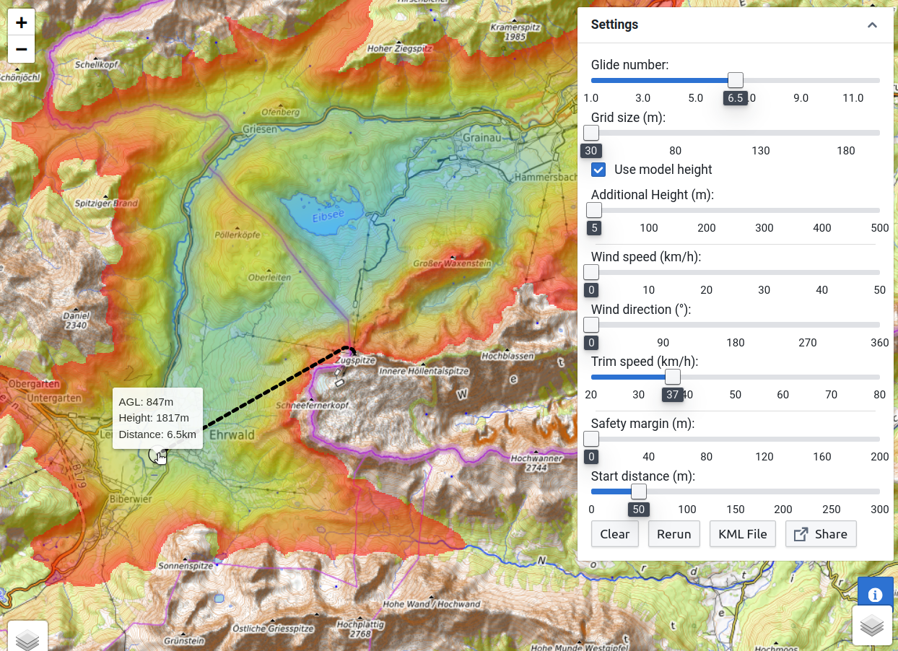

# Glide area calculator

This is a web application to calculate the glide area for paragliders.



## Running locally

The easiest way to run this application on your computer is using the provided docker image:

```
$ docker run -p 8080:8080 hoff97/hikeandfly:latest
```
You can then access the application at http://localhost:8080.

The docker image can be built with
```
$ docker buildx build --progress=plain -t hoff97/hikeandfly:latest ./
```
This will download some data for the digital evelation model (DEM). Change `backend-rust/download_data.sh`
according to your needs if you do not want to download all the data.

## Development

# Frontend

The frontend is built with react and can be run with
```
$ cd frontend
$ npm install
$ npm run
```

# Backend

The backend is built with rust. Run it in development mode using:
```
$ cd backend-rust
$ download_data.sh
$ cargo run
```
This might be a bit slow, alternatively, you can use `cargo run --release`.
`backend-rust/download_data.sh` will download some data for the digital evelation model (DEM). Change `backend-rust/download_data.sh`
according to your needs if you do not want to download all the data.

There is also an older (and slower) python backend in the `backend` folder.

## Performance testing

You can run performance tests using
```
$ cargo bench
```

A flamegraph can be generated by adding the following to `Cargo.toml`:
```
[profile.release]
#debug = 1
```
and then running
```
$ kernel.perf_event_paranoid = -1 #Only needed once to enable event counting for flamegraph
$ cargo flamegraph --bench search_benchmark -- --bench
```